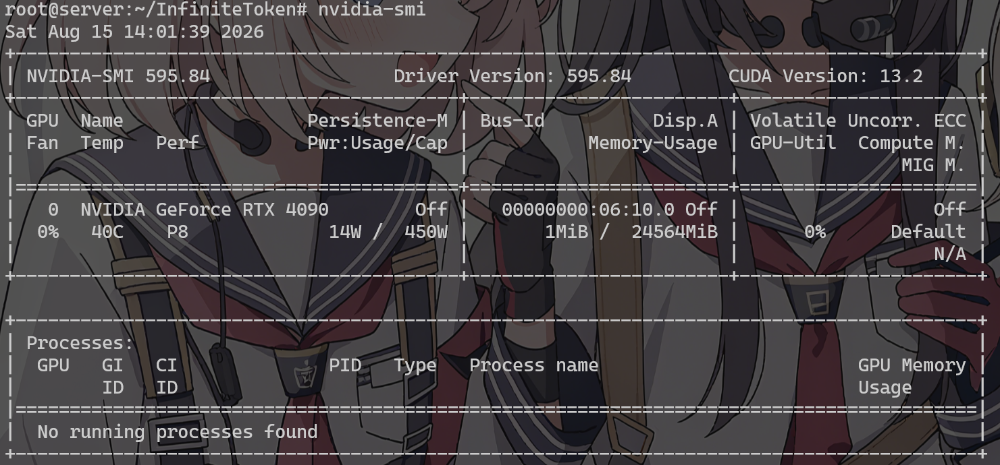

### 添加源
```bash
# 1.下载并导入GPG密钥
curl -fsSL https://nvidia.github.io/libnvidia-container/gpgkey | sudo gpg --dearmor -o /usr/share/keyrings/nvidia-container-toolkit-keyring.gpg

# 2.添加nvidia容器软件源
curl -s -L https://nvidia.github.io/libnvidia-container/stable/deb/nvidia-container-toolkit.list | \
sed 's#deb https://#deb [signed-by=/usr/share/keyrings/nvidia-container-toolkit-keyring.gpg] https://#g' | \
sudo tee /etc/apt/sources.list.d/nvidia-container-toolkit.list
```

### 安装依赖
```bash
# 更新软件源缓存
sudo apt update

# 安装依赖
sudo apt install -y nvidia-container-toolkit
sudo apt install python3.10-venv
sudo apt-get install nvidia-driver-590-open nvidia-dkms-590-open
```

#### 安装完成后正常识别GPU
```bash
nvidia-smi
```


#### 安装 CUDA Toolkit(后续编译需要)
```bash
wget https://developer.download.nvidia.com/compute/cuda/repos/ubuntu2204/x86_64/cuda-keyring_1.1-1_all.deb
sudo dpkg -i cuda-keyring_1.1-1_all.deb
sudo apt update
sudo apt install -y cuda-toolkit-12-4

# 设置环境变量
echo 'export PATH=/usr/local/cuda-12.4/bin:$PATH' >> ~/.bashrc
echo 'export LD_LIBRARY_PATH=/usr/local/cuda-12.4/lib64:$LD_LIBRARY_PATH' >> ~/.bashrc
source ~/.bashrc

#验证输出版本号
nvcc -V
```
